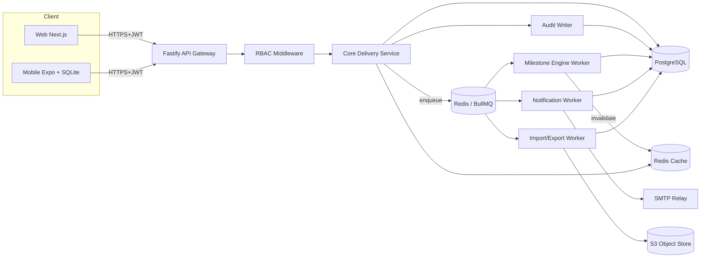
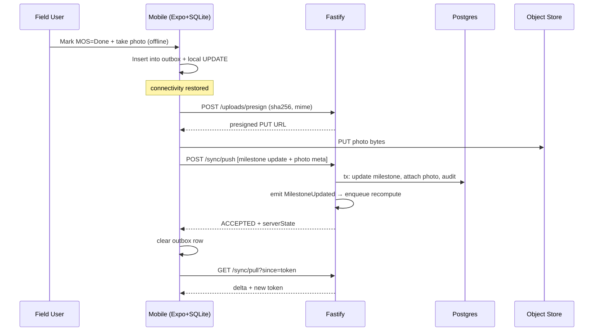

# 03 — System Design: DeliverIQ (Enterprise Project Delivery Dashboard)

**Author:** System Analyst (Stage 3)
**Date:** 2026-04-20
**Inputs:** `01-creator-vision.md`, `02-pm-roadmap.md`
**Tech stack (locked):** Next.js 14 (App Router, TS, Tailwind) · React Native + Expo (TS, offline) · Node.js + Fastify (TS) · PostgreSQL 15 + Prisma · Redis 7 (cache + BullMQ) · S3-compatible object storage · JWT auth · OpenTelemetry + Loki/Grafana for observability.
**Server timezone:** `Asia/Jakarta` (WIB, UTC+7). All dates persisted in UTC, presented in WIB.

---

## 1. High-Level Architecture (C4)

### 1.1 Context (Level 1)

```
                ┌────────────────────────────────────────────────────┐
                │              DeliverIQ Platform                    │
                │   (Web + Mobile + API + Workers + Datastores)      │
                └────────────────────────────────────────────────────┘
                  ▲              ▲              ▲              ▲
                  │              │              │              │
        ┌─────────┴───┐   ┌──────┴────┐  ┌──────┴────┐  ┌──────┴────┐
        │ Internal    │   │ Field /   │  │ Finance / │  │ Email/SMS │
        │ Users (BOD, │   │ Mitra     │  │ BOD       │  │ Provider  │
        │ DH, PM, AD) │   │ (Mobile)  │  │ (Web RO)  │  │ (stub)    │
        └─────────────┘   └───────────┘  └───────────┘  └───────────┘
                                  │
                                  └─► Geocoding API (deferred — Phase 2)
                                  └─► ERP / Finance system (Phase 2)
```

External actors: 6 user personas (Admin, BOD, Dept Head, PM, Field/Mitra, Finance). External systems (MVP): SMTP relay (email digest), object storage (S3/MinIO). External (Phase 2+): WhatsApp BSP, ERP, geocoding.

### 1.2 Containers (Level 2)

| # | Container | Tech | Responsibility |
|---|---|---|---|
| C1 | **Web App** | Next.js 14 (App Router, RSC, Tailwind) | Role-shaped dashboards (BOD/DH/PM/FN/AD), SSR for data-heavy pages, CSR for interactive editing |
| C2 | **Mobile App** | React Native + Expo (TS), `expo-sqlite` + custom sync layer | Field/Mitra offline updates, photo/geotag capture, background sync |
| C3 | **API Gateway** | Fastify (TS), `@fastify/jwt`, `@fastify/cors`, `@fastify/helmet`, `@fastify/rate-limit` | Single ingress for web + mobile; auth, RBAC enforcement, request validation (Zod), routing to services |
| C4 | **Auth Service** | Fastify module + Prisma | Login, JWT access/refresh issuance + rotation, password reset, lockout, audit |
| C5 | **Core Delivery Service** | Fastify module + Prisma | Order/SO/SOW/Site/Segment/Vendor/Claim CRUD, business rules, RBAC field-level |
| C6 | **Milestone Engine (Worker)** | Node.js worker (BullMQ consumer) | Recompute Progress %, GAP-day, Warning flag on milestone events; nightly recompute job; emit domain events |
| C7 | **Import/Export Service** | Fastify module + BullMQ producer + worker | Async Excel import (`exceljs`/`xlsx`), validation report, idempotent commit, export jobs |
| C8 | **File / Photo Storage** | S3-compatible (AWS S3 or MinIO on-prem) + presigned URLs | Photo evidence, exported XLSX, audit log archives |
| C9 | **Notification Service** | BullMQ worker + nodemailer (SMTP) + in-app event sink | Consume domain events; push in-app notifications (DB) + send email digest at 07:00 WIB |
| C10 | **PostgreSQL 15** | Managed Postgres (ID region) | Primary datastore; row-level scoping via app, not RLS, in MVP |
| C11 | **Redis 7** | Managed Redis | BullMQ job queues, dashboard query cache, refresh-token blacklist, rate-limit counters |
| C12 | **Observability Stack** | OpenTelemetry SDK → OTel Collector → Loki (logs) + Tempo (traces) + Prometheus/Grafana (metrics) | Structured logs (trace-id, user-id, request-id), RED metrics, alerting |
| C13 | **Object CDN (optional)** | CloudFront / Cloudflare in front of C8 | Photo delivery; signed URL TTL = 10 min |

All containers run in Docker; production targets a Kubernetes cluster (or single-VM Docker Compose for pilot if K8s unavailable).

### 1.3 Components (Level 3 — inside the API monolith)

The MVP backend is a **modular monolith** (Fastify) with clear module boundaries that could be split into services in Phase 3. Modules:

```
apps/api/src/
├── modules/
│   ├── auth/            (login, refresh, password-reset, lockout)
│   ├── users/           (CRUD, role assignment)
│   ├── rbac/            (policy engine, field-level ACL evaluator)
│   ├── orders/          (Order CRUD)
│   ├── sos/             (SO CRUD + state)
│   ├── sows/            (SOW CRUD + vendor assignment)
│   ├── sites/           (Site + Segment CRUD)
│   ├── milestones/      (CRUD, state machine, event emit)
│   ├── progress/        (Progress %, GAP-day, Warning rules — pure functions)
│   ├── vendors/         (Vendor master + assignment)
│   ├── claims/          (Claim queue + state)
│   ├── capex/           (CAPEX realization view + writes)
│   ├── imports/         (Excel parse + validate + commit)
│   ├── exports/         (XLSX generation jobs)
│   ├── reports/         (Dashboard aggregates, materialized views)
│   ├── notifications/   (in-app + email digest)
│   ├── audit/           (append-only writer + query)
│   ├── sync/            (mobile push/pull endpoints, conflict resolution)
│   └── health/          (/healthz, /readyz)
├── workers/
│   ├── milestone.worker.ts
│   ├── import.worker.ts
│   ├── export.worker.ts
│   ├── notification.worker.ts
│   └── digest.scheduler.ts
└── shared/ (db, logger, errors, validation, events)
```

Web modules:
```
apps/web/src/app/
├── (auth)/login, /reset-password
├── (bod)/portfolio
├── (dept)/funnel, /bottlenecks
├── (pm)/projects/[id]/{overview, timeline, sites, vendors, remarks}
├── (finance)/claims, /capex
├── (admin)/users, /vendors, /imports, /audit
├── api/ (BFF passthrough only — real logic on Fastify)
└── components/, lib/ (api client, auth, i18n)
```

Mobile modules:
```
apps/mobile/src/
├── screens/Login, Home, SiteList, SiteDetail, MilestoneUpdate, PhotoCapture, SyncStatus, Settings
├── db/ (expo-sqlite schema, migrations, repositories)
├── sync/ (pull, push, conflict-resolver, queue)
├── net/ (api client, retry, backoff)
└── i18n/ (id, en)
```

---

## 2. Use Cases / System Flows (MVP Epics)

Notation: `Actor → System: action ⇒ outcome`. Bracketed `[evt: X]` = domain event published.

### 2.1 Login & RBAC (EPIC 1)
1. User → Web/Mobile: POST `/auth/login` (email, password).
2. Auth Service: bcrypt-verify → issue access JWT (15 min) + refresh JWT (8 h) → record audit `LOGIN_SUCCESS`.
3. On 5 failed attempts in 10 min → lockout 15 min, audit `LOGIN_LOCKED`.
4. Every API request: gateway verifies JWT → loads role + scope (ownedProjectIds, deptId, assignedSiteIds) into `request.user` → RBAC middleware checks resource+action+field.
5. Field-level write rejected ⇒ 403 + audit `RBAC_DENIED`.

### 2.2 Excel Import (EPIC 2 — US-2.4)
1. Admin → Web: upload `Draft Dashboard.xlsx` → POST `/imports` (multipart) → file stored in S3, `Import` row created (status=`UPLOADED`).
2. API enqueues BullMQ job `import:parse`.
3. Import worker:
   a. Streams workbook with `exceljs` (memory-bounded).
   b. Maps each sheet (Order, SO/SOW, Sites, Milestones, Vendor) to staging tables.
   c. Runs validation rules (mandatory fields, FK lookups, date sanity, lat/long range).
   d. Persists `ImportReport` (per-row errors). Status → `VALIDATED`.
4. Admin → Web: reviews report → POST `/imports/{id}/commit` (or `/dry-run`).
5. Worker, in single transaction: upsert by natural key (e.g., `so_number`, `site_code`) → spawn milestones via template (US-4.1) → emit `[evt: ImportCommitted]`. Status → `COMMITTED`.
6. Idempotency: re-running same file (sha256) is a no-op; rerun with overrides flagged.
7. Rollback within 24 h: `/imports/{id}/rollback` reverses by `import_batch_id`.

### 2.3 Order → SO → SOW → Site Creation (EPIC 2/3)
1. PM → Web: create Order (customer, contractValue, OTC, MRC, capexBudget) → POST `/orders` → audit.
2. PM creates SO under Order → POST `/orders/{id}/sos` → date guards (SO range ⊆ Order range).
3. PM creates SOW under SO with planRfsDate + vendorId → POST `/sos/{id}/sows`.
4. On SOW create: trigger handler spawns 8 Milestones from template with derived plan dates (RFS-offset table). `[evt: SowCreated]`.
5. PM adds Sites (NE/FE) and Segments → POST `/sows/{id}/sites`, `/sows/{id}/segments`.
6. PM assigns FieldUser per site → mobile cache for that user invalidates on next pull.

### 2.4 Milestone Update (EPIC 4)
1. PM (web) or Field (mobile online) → PATCH `/milestones/{id}` `{status, actualDate, remark, photoIds[]}`.
2. Validation: status transition allowed (state machine §3.3); `actualDate` mandatory when `status=DONE`; backdate >30d ⇒ requires `dhApprovalToken`.
3. Service writes milestone, audit row, then enqueues BullMQ `milestone:recompute` for the parent SOW.
4. Emits `[evt: MilestoneUpdated]`.
5. Worker recomputes Progress % + GAP-day + Warning (§6) → updates `Sow.computed*` columns → emits `[evt: WarningRaised]` if level changed → invalidates dashboard cache keys.
6. Notification worker fans out (§2.10).

### 2.5 GAP-Day & Progress Recompute (EPIC 4)
- **Trigger paths:** (a) milestone write, (b) nightly cron at 02:00 WIB across all active SOWs, (c) admin manual recompute.
- Worker reads SOW + its milestones → applies pure functions in `progress/` module → writes `progressPct`, `gapDays`, `warningLevel`, `warningReason`, `lastComputedAt`.
- Idempotent; safe to run concurrently per-SOW (BullMQ key = sowId, concurrency=1 per key).

### 2.6 Mobile Offline Update + Sync (EPIC 7)
**Pull (download):**
1. App start / pull-to-refresh / network-up → GET `/sync/pull?since={lastSyncToken}&scope=mine`.
2. API returns delta: assigned sites, open milestones, last 30 d history, presigned photo URLs, server time, new `syncToken`.
3. Mobile upserts into `expo-sqlite` (per-table `updated_at` watermarks).

**Push (upload):**
1. User makes update offline → row inserted into `outbox` table (idempotency key = uuidv4 client-generated).
2. On connectivity → POST `/sync/push` with batch of outbox items (≤50) including `clientId`, `entity`, `entityId`, `op`, `payload`, `clientUpdatedAt`.
3. API per item:
   - **Conflict policy**:
     - `milestone.status` / `actualDate`: **server-wins if server `updatedAt > clientUpdatedAt`**, returns `REJECTED_STALE` with current server state for client merge UI.
     - `milestone.remark`: **append-only** (server appends client text + author + ts).
     - `photo`: **always accepted** (append-only attach to milestone); dedup by `sha256`.
     - `checkIn`: append-only.
   - Success → write + audit + emit events.
4. Response: per-item `{clientId, status: ACCEPTED|REJECTED_STALE|REJECTED_INVALID, serverState?}`.
5. Mobile clears accepted from outbox; surfaces rejected in "Sync issues" screen.

**Photo upload:** mobile gets presigned PUT URL via POST `/uploads/presign` then PUTs binary directly to S3 → POSTs metadata to `/sync/push`.

### 2.7 RFS Handover (EPIC 4 + 8)
1. Field/PM marks `RFS` milestone `DONE` with `actualDate`.
2. Engine recomputes; if all milestones `DONE` and last is RFS → SOW `deliveryStatus=RFS_ACHIEVED`. `[evt: RfsAchieved {sowId, actualDate}]`.
3. Claim record auto-created (status=`PENDING`) for each OTC + MRC line of that SOW.
4. Notification fanout: PM + Finance.

### 2.8 Revenue Claim (EPIC 8)
1. Finance → Web: GET `/claims?status=PENDING&sort=ageDesc` → claim queue.
2. Finance updates claim → PATCH `/claims/{id}` `{status: SUBMITTED|PAID, submittedDate, invoiceNumber, paidDate}`.
3. Transition guard: `PENDING → SUBMITTED → PAID` only. Backward = 403.
4. Audit + `[evt: ClaimStatusChanged]`. BOD revenue-at-risk recomputes.

### 2.9 BOD Drill-Down (EPIC 6)
1. BOD → Web `/portfolio` → SSR fetches `GET /reports/portfolio` (dept aggregates, KPI tiles).
2. Click dept → `/dept/{id}/funnel` → `GET /reports/dept-funnel?deptId=...`.
3. Click stage → `GET /reports/overdue?deptId=...&stage=...` (paginated list of SOWs).
4. Click SOW → `/projects/{sowId}` (PM workspace, BOD read-only mode).
5. Aggregates served from Redis cache (TTL 60 s); invalidated on `[evt: WarningRaised]`, `[evt: ClaimStatusChanged]`, `[evt: RfsAchieved]`.

### 2.10 Notification Trigger (EPIC 9)
1. Domain event consumed by `notification.worker`.
2. Resolves recipients: PM owner, assigned Field, DH of dept, optionally @mentioned users.
3. For each recipient → INSERT into `Notification` table (in-app) + push to user's WebSocket channel (Phase 2 — MVP polls every 60 s).
4. Daily 07:00 WIB cron: `digest.scheduler` selects unread+overdue per user, renders MJML template (ID/EN by user locale), enqueues SMTP send.

---

## 3. Data Flow Diagrams

### 3.1 End-to-End Write Flow



### 3.2 Mobile Sync Flow



### 3.3 Milestone State Machine

```mermaid
stateDiagram-v2
  [*] --> STIP_2_4
  STIP_2_4 --> STIP_10
  STIP_10 --> DESIGN
  DESIGN --> PROCUREMENT
  PROCUREMENT --> KOM
  KOM --> MATERIAL_READY
  MATERIAL_READY --> MOS
  MOS --> INSTALLATION
  INSTALLATION --> RFS
  RFS --> HANDOVER
  HANDOVER --> [*]

  note right of MOS: Per-milestone status enum:
        NOT_STARTED → IN_PROGRESS → DONE
        Any → BLOCKED (with reason)
        BLOCKED → IN_PROGRESS (resume)
```

**Sequencing rule:** A milestone may only enter `IN_PROGRESS` if the previous milestone is `DONE` **OR** override flag is set by DH (audited). `RFS` cannot be `DONE` unless `INSTALLATION.status=DONE`. `HANDOVER` is admin-completion of acceptance and unlocks Claim auto-creation when `RFS.status=DONE`.

### 3.4 Claim State Machine

```
PENDING ──submit──▶ SUBMITTED ──pay──▶ PAID
   │                    │
   └──cancel (FN+AD)────┴──cancel (FN+AD)──▶ CANCELLED (audit)
```

---

## 4. Module Decomposition

### 4.1 Backend (`apps/api`) — modular monolith

| Module | Responsibility | Key entities | Emits events |
|---|---|---|---|
| `auth` | Login, refresh, reset, lockout | User, RefreshToken | `UserLoggedIn`, `UserLockedOut` |
| `users` | User CRUD, role assignment | User, Role | `UserCreated/Updated` |
| `rbac` | Policy + field-ACL evaluation (pure) | — | — |
| `orders` | Order CRUD, financial header | Order | `OrderCreated/Updated` |
| `sos` | SO CRUD | SO | `SoCreated/Updated` |
| `sows` | SOW CRUD, milestone spawn on create | SOW, Milestone | `SowCreated`, `RfsAchieved` |
| `sites` | Site + Segment CRUD, geo validation | Site, Segment | `SiteAssigned` |
| `milestones` | Update, transitions, backdate guard | Milestone | `MilestoneUpdated`, `WarningRaised` |
| `progress` | Pure compute: Progress %, GAP, Warning | — | — |
| `vendors` | Vendor master, SOW assignment | Vendor, VendorAssignment | `VendorAssigned` |
| `claims` | Claim queue, state machine | Claim | `ClaimStatusChanged` |
| `capex` | CAPEX actuals (manual MVP) | CapexEntry | `CapexUpdated` |
| `imports` | Async import pipeline | Import, ImportRow | `ImportCommitted/RolledBack` |
| `exports` | Async XLSX export jobs | ExportJob | `ExportReady` |
| `reports` | Aggregates + cache | (views) | — |
| `notifications` | In-app + email digest | Notification, EmailLog | — |
| `audit` | Append-only writer + query | AuditLog | — |
| `sync` | Mobile pull/push + conflict resolver | (uses above) | (delegates) |
| `health` | `/healthz`, `/readyz` | — | — |

### 4.2 Frontend Web (`apps/web`)

| Module | Responsibility |
|---|---|
| `(auth)` | Login, password reset |
| `(bod)/portfolio` | KPI tiles, trends, drill-in |
| `(dept)` | Funnel, bottleneck, dept overview |
| `(pm)/projects/[id]` | Overview, timeline (Gantt-lite), sites, vendors, remarks, activity |
| `(finance)/claims` | Queue + edit |
| `(finance)/capex` | Realization grid |
| `(admin)` | Users, vendors, imports, audit viewer |
| `components/ui` | Tailwind primitives, shared design tokens |
| `lib/api` | Typed fetch client (zod-validated), auth interceptor |
| `lib/i18n` | next-intl, ID/EN bundles |
| `lib/rbac` | Client-side hide; server still enforces |

### 4.3 Mobile (`apps/mobile`)

| Module | Responsibility |
|---|---|
| `screens/*` | Field-user flows |
| `db/` | `expo-sqlite` schema + repositories |
| `sync/` | Pull, push, outbox, conflict resolver, retry/backoff |
| `net/` | Auth, presigned uploads |
| `media/` | Photo capture + EXIF + compression to ≤500 KB |
| `geo/` | Location services + check-in distance check |
| `i18n/` | id-ID default, en-US toggle |

### 4.4 Shared (`packages/shared`)

- Zod schemas (request/response) → reused by API + web + mobile.
- TypeScript types generated from Prisma + Zod.
- Domain enums (RoleEnum, MilestoneType, MilestoneStatus, ClaimStatus, WarningLevel).
- i18n keys catalog (`id.json`, `en.json`).

---

## 5. API Contract Overview

**Conventions**
- Base path: `/api/v1`.
- Auth: `Authorization: Bearer <accessJWT>`. Refresh: `POST /auth/refresh` with httpOnly refresh cookie.
- Content type: `application/json` (uploads multipart). All timestamps ISO-8601 UTC.
- Pagination: `?page=1&pageSize=50&sort=field:asc` → response `{data, pagination:{page,pageSize,total,totalPages}}`.
- Validation: server-side via Zod, errors return RFC 7807 problem+json.
- Error envelope:
  ```json
  { "type":"about:blank","title":"ValidationError","status":400,
    "code":"VALIDATION_FAILED","detail":"...","errors":[{"path":"so.start","msg":"..."}],
    "traceId":"...","requestId":"..." }
  ```
- Standard error codes: `400 VALIDATION_FAILED`, `401 UNAUTHENTICATED`, `403 FORBIDDEN`,
  `404 NOT_FOUND`, `409 CONFLICT` (state/idempotency), `422 BUSINESS_RULE`, `429 RATE_LIMITED`, `500 INTERNAL`.
- Idempotency: `Idempotency-Key` header on POST mutations (sync/push uses per-item `clientId`).

### 5.1 Auth
| Method | Path | Purpose | Roles |
|---|---|---|---|
| POST | `/auth/login` | Issue access+refresh | public |
| POST | `/auth/refresh` | Rotate tokens | authed (refresh cookie) |
| POST | `/auth/logout` | Invalidate refresh | authed |
| POST | `/auth/password-reset/request` | Send reset link | public |
| POST | `/auth/password-reset/confirm` | Set new password | public (token) |
| GET  | `/auth/me` | Current user + role + scopes | authed |

### 5.2 Users
| Method | Path | Purpose | Roles |
|---|---|---|---|
| GET | `/users` | List | AD, BOD |
| POST | `/users` | Create | AD |
| GET | `/users/{id}` | Detail | AD, BOD, self |
| PATCH | `/users/{id}` | Update (role/status) | AD |
| DELETE | `/users/{id}` | Soft-delete | AD |

### 5.3 Orders
| Method | Path | Purpose | Roles |
|---|---|---|---|
| GET | `/orders` | List (filtered) | AD, BOD, DH(dept), PM(owned), FN |
| POST | `/orders` | Create | AD, PM |
| GET | `/orders/{id}` | Detail | per scope |
| PATCH | `/orders/{id}` | Update header | AD, PM (own); FN (claim/CAPEX fields only — see §7) |
| DELETE | `/orders/{id}` | Soft-delete | AD |

### 5.4 SOs
| Method | Path | Purpose | Roles |
|---|---|---|---|
| GET | `/orders/{orderId}/sos` | List under order | per scope |
| POST | `/orders/{orderId}/sos` | Create | AD, PM |
| GET | `/sos/{id}` | Detail | per scope |
| PATCH | `/sos/{id}` | Update | AD, PM (own) |
| DELETE | `/sos/{id}` | Soft-delete | AD |

### 5.5 SOWs
| Method | Path | Purpose | Roles |
|---|---|---|---|
| GET | `/sos/{soId}/sows` | List | per scope |
| POST | `/sos/{soId}/sows` | Create (auto-spawns milestones) | AD, PM |
| GET | `/sows/{id}` | Detail (incl. milestones, vendors, sites) | per scope |
| PATCH | `/sows/{id}` | Update plan dates / vendor | AD, PM (own) |
| DELETE | `/sows/{id}` | Soft-delete | AD |
| POST | `/sows/{id}/recompute` | Force progress recompute | AD, PM |

### 5.6 Sites & Segments
| Method | Path | Purpose | Roles |
|---|---|---|---|
| GET | `/sows/{sowId}/sites` | List | per scope |
| POST | `/sows/{sowId}/sites` | Create site (NE/FE) | AD, PM |
| GET | `/sites/{id}` | Detail | per scope |
| PATCH | `/sites/{id}` | Update | AD, PM (own) |
| POST | `/sites/{id}/assign-field-user` | Assign field user | AD, PM (own) |
| GET | `/sows/{sowId}/segments` | List segments | per scope |
| POST | `/sows/{sowId}/segments` | Create (NE↔FE) | AD, PM |

### 5.7 Milestones
| Method | Path | Purpose | Roles |
|---|---|---|---|
| GET | `/sows/{sowId}/milestones` | List with status, plan, actual, gap | per scope |
| GET | `/milestones/{id}` | Detail with history | per scope |
| PATCH | `/milestones/{id}` | Update status/dates/remark | AD, PM (own), FE (assigned, mobile) |
| POST | `/milestones/{id}/photos` | Attach photo metadata after S3 PUT | AD, PM, FE (assigned) |
| POST | `/milestones/{id}/approve-backdate` | Approve >30d backdate | DH |

### 5.8 Vendors
| Method | Path | Purpose | Roles |
|---|---|---|---|
| GET | `/vendors` | List vendor master | AD, PM, DH, FN |
| POST | `/vendors` | Create | AD |
| PATCH | `/vendors/{id}` | Update / soft-delete | AD |
| POST | `/sows/{sowId}/vendors` | Assign vendor to SOW (SPK/PO dates) | AD, PM (own) |

### 5.9 Updates / Sync (mobile)
| Method | Path | Purpose | Roles |
|---|---|---|---|
| GET  | `/sync/pull` | Delta since token (assigned scope) | FE, PM |
| POST | `/sync/push` | Batch outbox commit | FE, PM |
| POST | `/uploads/presign` | Presigned PUT URL for photo | FE, PM, AD |
| POST | `/checkins` | Field check-in (geotag) | FE |

### 5.10 Claims
| Method | Path | Purpose | Roles |
|---|---|---|---|
| GET | `/claims` | Queue (filters: status, age, customer) | FN, BOD, AD |
| GET | `/claims/{id}` | Detail | FN, BOD, PM (own), AD |
| PATCH | `/claims/{id}` | Update status/dates/invoice | FN |
| POST | `/claims/{id}/cancel` | Cancel (rare) | FN + AD co-sign |

### 5.11 CAPEX
| Method | Path | Purpose | Roles |
|---|---|---|---|
| GET | `/capex/by-so/{soId}` | Budget vs actual vs % | FN, PM (own), BOD, AD |
| POST | `/capex/by-so/{soId}/entries` | Add actual entry | FN |
| PATCH | `/capex/entries/{id}` | Edit entry | FN |

### 5.12 Imports / Exports
| Method | Path | Purpose | Roles |
|---|---|---|---|
| POST | `/imports` | Upload XLSX, start parse | AD |
| GET  | `/imports/{id}` | Status + report | AD |
| POST | `/imports/{id}/commit` | Commit validated rows | AD |
| POST | `/imports/{id}/rollback` | Rollback within 24 h | AD |
| POST | `/exports` | Enqueue export (scope, filters) | per scope |
| GET  | `/exports/{id}` | Status + signed download URL | requester |

### 5.13 Reports
| Method | Path | Purpose | Roles |
|---|---|---|---|
| GET | `/reports/portfolio` | BOD KPIs | BOD, AD |
| GET | `/reports/dept-funnel` | Dept milestone funnel | DH, BOD, AD |
| GET | `/reports/overdue` | Overdue list (filterable) | DH, PM, BOD, AD |
| GET | `/reports/rfs-monthly` | Plan vs actual RFS by month | BOD, DH, AD |
| GET | `/reports/revenue-at-risk` | At-risk Σ(OTC+MRC) | BOD, FN, AD |
| GET | `/reports/data-quality` | Mandatory-field completeness | AD, DH |

### 5.14 Notifications & Audit
| Method | Path | Purpose | Roles |
|---|---|---|---|
| GET | `/notifications` | In-app feed | self |
| POST | `/notifications/{id}/read` | Mark read | self |
| GET | `/audit` | Search audit log | AD |
| GET | `/audit/export` | XLSX export | AD |

### 5.15 Health
| Method | Path | Purpose | Roles |
|---|---|---|---|
| GET | `/healthz` | Liveness | public |
| GET | `/readyz` | Readiness (DB, Redis, S3) | public |

---

## 6. Status / Progress Calculation Rules (Formal)

### 6.1 Milestone Weights (default — DH must validate)

| Code | Milestone | Weight |
|---|---|---|
| `STIP_2_4` | STIP 2/4 | 5 |
| `STIP_10` | STIP 10 | 5 |
| `DESIGN` | Design | 10 |
| `PROCUREMENT` | Procurement | 15 |
| `KOM` | Kick-Off Meeting | 5 |
| `MATERIAL_READY` | Material Ready | 15 |
| `MOS` | Method of Statement | 5 |
| `INSTALLATION` | Installation | 25 |
| `RFS` | Ready For Service | 15 |
| **Total** | | **100** |

(`HANDOVER` is administrative completion, weight 0; required for Claim creation.)

### 6.2 Progress %

Per-milestone completion factor:
```
completion(m) = 1.0   if m.status = DONE
              = 0.5   if m.status = IN_PROGRESS
              = 0.0   if m.status = NOT_STARTED or BLOCKED
```

```
ProgressPct(SOW) = Σ ( weight(m) × completion(m) )    // 0..100, rounded to 1 dp
```

### 6.3 GAP Day to RFS

Let `today = currentDate(WIB)`, `planRfs = SOW.planRfsDate`, `actualRfs = SOW.RFS.actualDate`.

```
if RFS.status = DONE:
    gapDays = ceil( actualRfs - planRfs )    // can be negative (early)
else:
    forecastRfs = max(today, planRfs) + Σ(remainingPlannedDuration of NOT_STARTED milestones based on plan dates)
    // Simpler MVP form: forecastRfs = max(planRfs, latest_actual_or_today_of_in_progress_chain)
    gapDays = ceil( forecastRfs - planRfs )
```

MVP simplified default (avoids forecast modeling): `gapDays = ceil(today − planRfs)` while RFS not done; clamps to 0 if today ≤ planRfs and no overdue upstream milestone.

### 6.4 Warning Level

Compute `warningLevel ∈ { ON_TRACK, AT_RISK, DELAY }`:

```
overdue(m)   = m.status ∈ {NOT_STARTED, IN_PROGRESS, BLOCKED}
               AND m.planDate IS NOT NULL
               AND today − m.planDate > 3 days

anyOverdue   = ∃ m in SOW.milestones : overdue(m)
maxOverdueD  = max(today − m.planDate) over overdue milestones (else 0)

rfsImminentNoInstall =
   (planRfs − today) ≤ 14 days
   AND INSTALLATION.status = NOT_STARTED

if RFS.status = DONE:
    warningLevel = ON_TRACK   // closed
else if anyOverdue AND maxOverdueD > 7  OR  gapDays > 7  OR  rfsImminentNoInstall:
    warningLevel = DELAY
else if anyOverdue OR (1 ≤ gapDays ≤ 7):
    warningLevel = AT_RISK
else:
    warningLevel = ON_TRACK
```

Pseudocode is canonical (`packages/shared/progress.ts`); QA truth tables MUST cover all branches.

### 6.5 Revenue at Risk

```
RevenueAtRisk = Σ (SOW.OTC + SOW.MRC × monthsToRecognize) for SOWs where warningLevel ∈ {AT_RISK, DELAY}
```
(MRC horizon default: 12 months — configurable, default per L6 sponsor sign-off pending.)

---

## 7. RBAC Matrix

Roles: **AD** Admin · **BOD** · **DH** Dept Head (Enterprise/PreSales/TEL/Project) · **PM** · **FE** Field/Mitra · **FN** Finance.

`R` = read · `W` = write/create/update · `D` = delete (soft) · `–` = forbidden. Scopes: `*` all, `dept` own dept only, `own` own/assigned, `assigned` field-assigned site only.

| Resource / Action | AD | BOD | DH | PM | FE | FN |
|---|---|---|---|---|---|---|
| User mgmt | RWD | – | – | – | – | – |
| Order header | RWD `*` | R `*` | RW `dept` | RW `own` | – | R `*` |
| Order financial fields (OTC/MRC/CAPEX budget) | RW | R | R | R | – | R |
| SO | RWD `*` | R `*` | RW `dept` | RW `own` | – | R `*` |
| SOW | RWD `*` | R `*` | RW `dept` | RW `own` | R `assigned` | R `*` |
| Site / Segment | RWD `*` | R `*` | RW `dept` | RW `own` | R `assigned` | R `*` |
| Milestone status / actualDate | RW `*` | R `*` | RW `dept` (+ approve backdate) | RW `own` | RW `assigned` (mobile only) | R `*` |
| Milestone plan dates | RW `*` | R `*` | RW `dept` | RW `own` | – | R `*` |
| Photo upload | RW | R | R `dept` | RW `own` | RW `assigned` | R |
| Vendor master | RWD | R | R | R | – | R |
| Vendor assignment to SOW | RW `*` | R | RW `dept` | RW `own` | R `assigned` | R |
| Claim status / dates / invoice | RW | R | R `dept` | R `own` | – | RW `*` |
| CAPEX actuals | RW | R | R `dept` | R `own` | – | RW `*` |
| Excel import / commit / rollback | RW | – | – | – | – | – |
| Excel export | RW | R | R `dept` | R `own` | – | R `*` |
| Reports (portfolio/funnel/overdue/RaR/DQ) | R | R | R `dept` | R `own` | – | R `*` (revenue) |
| Audit log | R `*` | – | R `dept` | – | – | – |
| Notifications (own) | RW | RW | RW | RW | RW | RW |

**Field-level enforcement** (server-side in `rbac` module): policies declared per resource as `{role → {fields: read[], write[]}}`. Policy table is the single source of truth; UI mirrors but never substitutes.

---

## 8. Non-Functional Requirements

### 8.1 Performance
- Read APIs P95 < **500 ms** at pilot scale (400 sites × 8 milestones × 12 mo history).
- Mobile sync `/sync/pull` P95 < **2 s** for 50-site cache.
- Excel import 1 000 rows: **async**, completes < **90 s** P95 (worker), API responds < **300 ms** with job id.
- Dashboard aggregates: cached in Redis, TTL 60 s, cold-build < **1.5 s**.
- Report endpoints paginated (default 50, max 200).
- Index strategy: composite indexes on `(deptId, warningLevel)`, `(sowId, planDate)`, `(assignedFieldUserId, status)`, `(importBatchId)`, `(siteId, milestoneType)`. `pg_trgm` on `customer.name`, `vendor.name` for search.

### 8.2 Availability
- MVP target **99.5%** monthly uptime (Phase 2 → 99.9%).
- RPO ≤ 24 h (nightly Postgres backup + WAL archive), RTO ≤ 4 h.
- BullMQ workers: ≥2 replicas; idempotent jobs.

### 8.3 Security Baseline
- TLS 1.2+ everywhere; HSTS; HTTP→HTTPS redirect at ingress.
- JWT: HS256 in MVP (rotate secret quarterly), access TTL 15 min, refresh TTL 8 h, refresh rotation + reuse-detection blocklist in Redis.
- Password: bcrypt cost 12, policy ≥10 chars/1 number/1 symbol.
- Lockout 5 attempts / 10 min.
- OWASP Top 10:
  - SQLi: Prisma parameterized queries only.
  - XSS: React auto-escape; `dompurify` for any rich-text remark render.
  - CSRF: refresh cookie `SameSite=Strict, HttpOnly, Secure`; access JWT in header (no cookie).
  - SSRF: outbound calls allow-listed (SMTP, S3 only).
  - Headers: helmet defaults + CSP `default-src 'self'`.
- Rate limit: 100 req/min/IP global, 5 req/min per email on `/auth/login` & password-reset.
- Photo metadata: strip non-essential EXIF except GPS+timestamp before storage; signed URL TTL 10 min.
- Audit log append-only: write via separate role grant; nightly hash-chain integrity job (`prevHash → currentHash`).
- PDP: data residency = ID region; PII columns (email, phone, name) encrypted at rest via Postgres pgcrypto column encryption (Phase 2 hardens to KMS).

### 8.4 Observability
- Logs: JSON structured (`pino`), fields `level, ts, traceId, spanId, requestId, userId, route, status, durationMs`. Shipped to Loki.
- Metrics: Prometheus `/metrics`; RED per route, BullMQ job duration/failure, DB pool stats.
- Traces: OpenTelemetry; propagate `traceparent`; mobile sends `traceparent` on each call.
- Alerts (Grafana): API 5xx > 1% over 5 min, P95 > 1 s for 10 min, BullMQ failure rate > 5%, DB connection saturation > 80%.

### 8.5 Accessibility & i18n
- WCAG 2.1 AA targets on web; keyboard navigation; color-contrast ≥ 4.5:1.
- `next-intl` ID/EN; default `id-ID`. All keys in `packages/shared/i18n`.

---

## 9. Integrations

### 9.1 Excel Import/Export
- Library: **`exceljs`** (streaming reader + writer) for memory-bounded handling of large `Draft Dashboard.xlsx`.
- Sheet → entity mapping defined in Data Agent artifact (Stage 5 dependency).
- Validation rules expressed as Zod schemas reused by UI preview.

### 9.2 Geocoding (Deferred — Phase 2)
- Stub interface `GeocodingProvider.resolve(address) → {lat,lng,confidence}`. MVP returns `null`; UI accepts manual lat/long.

### 9.3 Email Provider (MVP)
- SMTP via `nodemailer`. Provider-agnostic (SES, Mailgun, SMTP relay). Templates rendered via `mjml` → HTML; ID/EN by user locale.
- Rate-limited per user (digest = 1/day/category).

### 9.4 SMS / WhatsApp (Stub)
- `NotificationChannel` interface allows pluggable transport. MVP wires only `inApp` and `email`. Phase 2 adds `whatsapp` (BSP).

### 9.5 ERP / Finance (Phase 2 — out of MVP scope)
- Defined as outbound webhook `/webhooks/claim-eligible` consumer + inbound `/erp/capex-actuals` ingest endpoint.

---

## 10. Architecture Decision Records (ADR)

### ADR-001: Fastify over Express
- **Decision:** Use Fastify 4 for the API.
- **Why:** ~2× throughput vs Express on Node 20, built-in JSON-schema validation, first-class TypeScript types, plugin model that maps cleanly to our module decomposition, native `pino` logging integration. Express's middleware ecosystem advantage is irrelevant for a greenfield TS API. Performance NFR (P95 < 500 ms) is easier to defend with Fastify under load.
- **Trade-off:** Smaller community for some niche middlewares; we accept by sticking to first-party `@fastify/*` plugins.

### ADR-002: Prisma over TypeORM
- **Decision:** Prisma 5 as ORM + migration tool.
- **Why:** Schema-first DX (single `schema.prisma` source of truth), generated fully-typed client (eliminates a class of runtime bugs), best-in-class Postgres support, mature migration workflow with shadow DB, integrates cleanly with Zod via `prisma-zod-generator`. TypeORM's decorator/active-record style produces brittle types and weaker migrations.
- **Trade-off:** Less flexible for complex raw SQL; we use `prisma.$queryRaw` for the few aggregate report queries.

### ADR-003: Mobile offline storage — `expo-sqlite` + custom sync layer (NOT WatermelonDB)
- **Decision:** Use `expo-sqlite` directly with a thin custom sync layer (outbox + watermark).
- **Why:**
  - WatermelonDB is powerful but opinionated (its own observable model), and its sync protocol assumes a server contract that we'd still have to build server-side either way.
  - Our entity model is small (≤10 tables on mobile) and writes are predominantly milestone updates + photos — a custom outbox is simpler to reason about, debug, and audit.
  - `expo-sqlite` is officially supported by Expo SDK 50+, no ejection required, and tooling (Hermes-compatible) is stable.
  - Conflict policy is simple and field-specific (server-wins for status, append-only for photos/remarks) — easier to implement directly than to bend WatermelonDB's sync hooks.
- **Trade-off:** We write our own observable layer for live UI updates (using `react-query` + manual invalidation on outbox events). Acceptable for MVP scope.
- **Revisit:** Re-evaluate at Phase 3 if mobile entity count > 25 or multi-user collaborative editing is added.

### ADR-004: Modular monolith over microservices
- **Decision:** Single deployable Fastify monolith with internal module boundaries; workers split as separate processes.
- **Why:** Team is 5 engineers; microservices overhead (service mesh, distributed tracing, schema registry) is not justified at MVP scale. Module boundaries (§4.1) preserve future split paths.

### ADR-005: BullMQ on Redis for jobs/events
- **Decision:** BullMQ for background jobs and intra-app event bus (MVP).
- **Why:** Already need Redis for cache + rate limit; BullMQ is mature, supports prioritized queues, repeatable jobs (cron), and idempotency keys. Avoids introducing Kafka/RabbitMQ for MVP.
- **Revisit:** Phase 3 may move to Kafka if external event publishing or multi-consumer streams emerge.

### ADR-006: Authorization model — code-policy table, no DB RLS in MVP
- **Decision:** RBAC enforced in API via a centralized policy table (`rbac` module); no Postgres Row-Level Security in MVP.
- **Why:** RLS adds operational complexity (every connection role-aware) and migration cost; app-side policy with audit coverage is sufficient at pilot scale and easier to test (truth tables).
- **Trade-off:** Bypassing the API (e.g., direct DB access by ops) is not policy-enforced; mitigated by network isolation and audited DB access.

### ADR-007: Dashboard aggregates — Redis cache + on-event invalidation; no materialized views in MVP
- **Decision:** Compute aggregates on demand, cache in Redis (TTL 60 s), invalidate on relevant domain events.
- **Why:** Pilot scale (≤500 SOWs, ≤4000 milestones) is comfortably handled by Postgres with proper indexes; materialized views add refresh complexity. If Phase 2 adds analytics depth, introduce `pg_cron`-refreshed materialized views.

---

## 11. Use Cases & Data Flow Summary (Traceability)

| Vision/PM Item | Use Case (§2) | API (§5) | Calc (§6) | RBAC (§7) | NFR (§8) |
|---|---|---|---|---|---|
| F1/F2 Auth+RBAC | 2.1 | 5.1, 5.2 | — | all | 8.3 |
| F3 Entity model | 2.3 | 5.3–5.6 | — | all | 8.1 |
| F4 Excel import | 2.2 | 5.12 | — | AD | 8.1 (async) |
| F5 Excel export | — | 5.12 | — | per scope | 8.1 |
| F7 Milestones | 2.4 | 5.7 | 6.1 | PM/FE | 8.1 |
| F8 Engine | 2.5 | 5.5 (recompute) | 6.2–6.4 | system | 8.1, 8.4 |
| F9 Vendor | 2.3 | 5.8 | — | AD/PM | — |
| F10–F12 Dashboards | 2.9 | 5.13 | 6.5 | BOD/DH/PM | 8.1 |
| F13–F15 Mobile | 2.6 | 5.9 | — | FE | 8.1, 8.3 |
| F16–F17 Claim/CAPEX | 2.7, 2.8 | 5.10, 5.11 | — | FN | — |
| F18 Notifications | 2.10 | 5.14 | — | self | 8.4 |
| F19 Audit | all | 5.14 | — | AD | 8.3 |
| F21 Health | — | 5.15 | — | public | 8.4 |

---

## 12. Collaboration Handoff

### To UI/UX (Stage 4)
- Use API contract (§5) for screen data shapes.
- Required screens at minimum:
  - Web: Login, Reset, BOD Portfolio, Dept Funnel, PM Project Workspace (Overview/Timeline/Sites/Vendors/Remarks), Finance Claims Queue, Finance CAPEX, Admin Users/Vendors/Imports/Audit.
  - Mobile: Login, Home (assigned sites count, sync status), Site List, Site Detail, Milestone Update, Photo Capture, Sync Status (pending/issues), Settings (locale).
- Visual states required: `On Track / At Risk / Delay` color tokens, milestone status chips, sync state (synced/pending/error), offline banner.
- i18n: all copy in keys; default ID.

### To Data (Stage 5)
- Implement Prisma schema for entities listed in §4 + audit + sync watermark tables.
- Provide Excel→entity mapping spec for `Draft Dashboard.xlsx`.
- Provide seed dataset (≥40 SOWs, ≥160 sites) for dev + UAT.
- Define indexes per §8.1.
- Confirm `HANDOVER` modeled as separate milestone or SOW field.

### To Coder (Stage 6)
- Build modular monolith per §4.1; spike importer in W2 (PM-R1).
- Implement `progress` module as pure functions with truth-table tests (QA dependency).
- Mobile sync per §2.6 + ADR-003.
- All APIs per §5 with Zod schemas in `packages/shared`.

### To QA (Stage 7)
- Test focus areas:
  1. RBAC matrix (every cell of §7) — server-side enforcement, not just UI.
  2. Importer fuzz (malformed cells, merged headers, idempotency, rollback).
  3. Milestone engine truth tables (§6.4 covers all branches).
  4. Mobile offline scenarios (airplane mode, partial sync, conflict resolution, photo dedup).
  5. Performance: P95 < 500 ms for read APIs at pilot scale (seed dataset).
  6. State machine transitions (milestone, claim) — illegal transitions return 409/422.

### To Security (Stage 9)
- Threat model focus: JWT/refresh hardening, audit-log integrity hash-chain, photo PII (geotag), import file scanning (malicious XLSX), RBAC bypass via direct sync endpoints.

### To DevOps (Stage 10)
- Single docker-compose for dev (api, web, mobile expo go target, postgres, redis, minio, mailhog, otel-collector, grafana).
- CI: lint, type-check, unit, integration, build, image push.
- CD: staging on main merge; prod on tag with manual approval.
- Backups: nightly pg_dump + WAL archive to S3; restore drill quarterly.

### Open Questions (block-by-block)

| # | Question | For | Why blocking |
|---|---|---|---|
| Q1 | Final milestone weights — confirm or change defaults (§6.1)? | DH council via PM | Affects Progress % and dashboards |
| Q2 | RFS forecast formula — accept "today − planRfs" simplification or build chained forecast (§6.3)? | DH council | Engine complexity & test surface |
| Q3 | Confirm `Asia/Jakarta` storage convention (UTC store, WIB display)? | PM | Date arithmetic in engine |
| Q4 | Audit hash-chain mandatory in MVP or OK as Phase 2 hardening? | Security | Implementation effort |
| Q5 | Map `HANDOVER` as 9th milestone (with weight 0) or as SOW field? | Data agent | Schema |
| Q6 | Photo retention period? (proposal: 24 mo hot, then archive) | Security + Finance | Storage cost |
| Q7 | Refresh-token storage: Redis vs DB? (proposal: Redis with reuse-detection) | Security | NFR 8.3 |
| Q8 | Confirm "Revenue at Risk" MRC horizon = 12 months (§6.5)? | Finance + BOD (decision L6) | KPI definition |
| Q9 | i18n governance — who translates and reviews ID strings? | PM | Release cadence |
| Q10 | Backdate approval — DH approval required >30 d as proposed, or different threshold? | DH council | UX of milestone update |

---

## 13. Handoff

- **Inputs consumed:**
  - `c:\Users\soega\Project BAru\run\20260420_Enterprise_Project_Delivery_Dashboard\.artifacts\01-creator-vision.md`
  - `c:\Users\soega\Project BAru\run\20260420_Enterprise_Project_Delivery_Dashboard\.artifacts\02-pm-roadmap.md`

- **Outputs produced:**
  - `c:\Users\soega\Project BAru\run\20260420_Enterprise_Project_Delivery_Dashboard\.artifacts\03-sa-system-design.md` (this document).

- **Open questions:** Q1–Q10 in §12. Recommend defaults be adopted unless overridden by W4 (otherwise Coder will proceed with the defaults defined here).

- **Go/No-Go Recommendation:** **GO.** Architecture is implementable on the locked stack within the 12-week MVP window. UI/UX, Data, and Coder are cleared to proceed in parallel where feasible (UI/UX & Data first, Coder begins W1 scaffolding and W2 importer spike per PM plan). Critical-path watch items unchanged from PM: importer (W4) and mobile sync (W9–W10).
