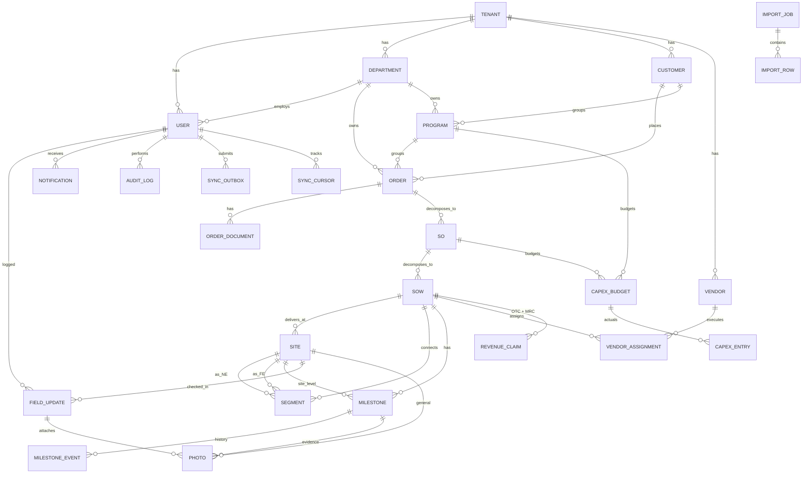

# 05 — Data Design: DeliverIQ (Enterprise Project Delivery Dashboard)

**Author:** Data Agent (Stage 5)
**Date:** 2026-04-20
**Inputs consumed:** `01-creator-vision.md`, `02-pm-roadmap.md`, `03-sa-system-design.md`, `04-uiux-design.md`
**Database:** PostgreSQL 15 (extensions: `pgcrypto`, `pg_trgm`, `citext`)
**ORM:** Prisma 5
**Conventions:**
- All money in `Decimal(18,2)` (IDR), `currency` column defaults to `IDR`.
- All timestamps stored UTC; presentation layer converts to `Asia/Jakarta` (WIB).
- Soft delete: nullable `deletedAt` on every domain entity. Default queries filter `deletedAt IS NULL` via Prisma middleware.
- Optimistic concurrency: `version Int @default(1)` on all editable entities; bumped in service layer (`UPDATE ... WHERE id=? AND version=?`).
- Multi-tenant ready: every domain entity carries nullable `tenantId` (`@db.Uuid`). MVP runs single-tenant (`tenantId IS NULL`); composite uniques and indexes are tenant-prefixed for safe rollout later.

---

## 1. Conceptual Model (ERD)

### 1.1 Entity inventory

| Group | Entities |
|---|---|
| Identity | `Tenant`, `User`, `Role`, `RefreshToken` |
| Org master | `Department`, `Customer`, `Program`, `Vendor` |
| Delivery | `Order`, `OrderDocument`, `SO`, `SOW`, `Site`, `Segment`, `VendorAssignment` |
| Milestone | `Milestone`, `MilestoneEvent` |
| Mobile field | `FieldUpdate`, `Photo` |
| Finance | `RevenueClaim`, `CapexBudget`, `CapexEntry` |
| Cross-cutting | `Notification`, `AuditLog`, `ImportJob`, `ImportRow`, `SyncOutbox`, `SyncCursor` |

### 1.2 Mermaid ER overview



### 1.3 Key relationships & cardinality

| Relationship | Card. | Notes |
|---|---|---|
| Order → SO | 1..N | SO date range ⊆ Order date range. |
| SO → SOW | 1..N | SOW carries `planRfsDate` (mandatory). |
| SOW → Site | 1..N | Each SOW has ≥1 Site. NE/FE roles via `Site.type`. |
| SOW → Segment | 0..N | Segment links exactly 1 NE Site + 1 FE Site within same SOW. |
| SOW → Milestone | 1..N | Spawn template = 9 active types + `HANDOVER` administrative; weight sum = 100. |
| Milestone → MilestoneEvent | 1..N | Append-only history; idempotent via `clientId`. |
| Site → FieldUpdate → Photo | 1..N..N | Mobile capture chain. Photo dedup by SHA-256. |
| SOW → RevenueClaim | 1..N | Auto-spawn 1 OTC + N MRC (per-month) on RFS achieved. |
| Program / SO → CapexBudget → CapexEntry | 1..N..N | Manual entries in MVP. |

Cascade rules: `Order DELETE` cascades through `SO → SOW → Site/Segment/Milestone/VendorAssignment/Photo/Claim`. Soft-delete is the default; hard cascade only used in admin purge job.

---

## 2. Logical Schema (Prisma)

The complete `schema.prisma` is written to:

`src/database/prisma/schema.prisma`

Highlights (full file in repo):

- Enums declared exactly as required: `OrderType`, `ProductCategory`, `SiteType`, `SiteOwner`, `MilestoneType`, `MilestoneStatus`, `OverallStatus` (`ON_TRACK`/`AT_RISK`/`DELAY`), `ClaimType`, `ClaimStatus`, `UserRole`, `ImportStatus`. Plus supporting enums: `UserStatus`, `ImportRowStatus`, `NotificationKind`, `NotificationChannel`, `AuditAction`, `SyncOp`, `SyncStatus`, `CapexCategory`.
- Money columns: `Decimal(18,2)` (`contractValue`, `otcAmount`, `mrcAmount`, `capexBudget`, `RevenueClaim.amount`, `CapexEntry.amount`).
- Geo: `Decimal(9,6)` lat/long.
- Soft delete: `deletedAt DateTime?` on all editable entities.
- Optimistic lock: `version Int @default(1)` on all editable entities.
- Multi-tenant: `tenantId String? @db.Uuid` on every domain entity; tenant-prefixed unique constraints (`@@unique([tenantId, code])`).
- Engine outputs denormalized on `SOW` and `Site` (`progressPct`, `gapDays`, `warningLevel`, `lastComputedAt`) for sub-second dashboard reads.
- Mobile sync: `SyncOutbox` (per-item idempotency via unique `clientId`), `SyncCursor` (per-user/scope watermark).
- Audit log: `BigInt` PK, append-only, optional hash-chain (`prevHash`, `hash`) for Phase-2 hardening.
- Photo dedup: global `@@unique([sha256])`.

Trigram (`pg_trgm`) GIN indexes are added via raw migration (Prisma cannot declare them natively):

```sql
CREATE INDEX customer_name_trgm_idx ON "Customer" USING GIN (name gin_trgm_ops);
CREATE INDEX vendor_name_trgm_idx   ON "Vendor"   USING GIN (name gin_trgm_ops);
CREATE INDEX site_name_trgm_idx     ON "Site"     USING GIN (name gin_trgm_ops);
```

---

## 3. ERD Specification

| Parent | Child | FK column | Cardinality | Mandatory? | On Delete |
|---|---|---|---|---|---|
| Tenant | User, Department, Customer, Program, Vendor, Order | `tenantId` | 1..N | Optional (MVP) | Restrict |
| Department | User | `departmentId` | 0..N | Optional | SetNull |
| Department | Order, Program | `departmentId` | 0..N | Optional | SetNull |
| Customer | Order | `customerId` | 1..N | Required | Restrict |
| Program | Order | `programId` | 0..N | Optional | SetNull |
| Order | OrderDocument | `orderId` | 0..N | Required | Cascade |
| Order | SO | `orderId` | 1..N | Required | Cascade |
| SO | SOW | `soId` | 1..N | Required | Cascade |
| SOW | Site | `sowId` | 1..N | Required | Cascade |
| SOW | Segment | `sowId` | 0..N | Required | Cascade |
| Site | Segment (NE) | `neSiteId` | 0..N | Required | Restrict |
| Site | Segment (FE) | `feSiteId` | 0..N | Required | Restrict |
| SOW | Milestone | `sowId` | 1..N (=10 typical) | Required | Cascade |
| Site | Milestone (per-site) | `siteId` | 0..N | Optional | Cascade |
| Milestone | MilestoneEvent | `milestoneId` | 1..N | Required | Cascade |
| SOW | VendorAssignment | `sowId` | 0..N | Required | Cascade |
| Vendor | VendorAssignment | `vendorId` | 0..N | Required | Restrict |
| Site | FieldUpdate | `siteId` | 0..N | Required | Cascade |
| User | FieldUpdate | `userId` | 0..N | Required | Restrict |
| Site / Milestone / FieldUpdate | Photo | `siteId/milestoneId/fieldUpdateId` | 0..N | At least one set | Cascade |
| SOW | RevenueClaim | `sowId` | 0..N | Required | Cascade |
| Program / SO | CapexBudget | `programId / soId` | 0..N | Either parent | SetNull |
| CapexBudget | CapexEntry | `capexBudgetId` | 0..N | Required | Cascade |
| User | Notification, RefreshToken, SyncOutbox, SyncCursor | `userId` | 0..N | Required | Cascade |

---

## 4. Index & Query Plan

### 4.1 High-volume read workloads

| ID | Workload | Endpoint | Predicate / Sort | Supporting index |
|---|---|---|---|---|
| Q1 | BOD portfolio aggregate | `GET /reports/portfolio` | `tenantId, deletedAt IS NULL`, group by `warningLevel`, `departmentId` | `SOW(warningLevel, planRfsDate)`, `Order(tenantId, departmentId)` (covers join) |
| Q2 | Dept funnel | `GET /reports/dept-funnel?deptId` | `Order.departmentId = ?`, group by `Milestone.type, Milestone.status` | `Milestone(status, planDate)` + `Order(tenantId, departmentId)` |
| Q3 | Overdue scan (engine cron) | nightly worker | `Milestone.status IN (NOT_STARTED, IN_PROGRESS, BLOCKED) AND planDate < today - 3` | `Milestone(planDate)` + partial index (see below) |
| Q4 | Mobile delta — sites | `GET /sync/pull?since=t&scope=mine` | `Site.assignedFieldUserId = ? AND updatedAt > ?` | `Site(assignedFieldUserId, updatedAt)` |
| Q5 | Mobile delta — milestones | (same call) | `Milestone.sowId IN (...) AND updatedAt > ?` | `Milestone(updatedAt)` |
| Q6 | PM project workspace | `GET /sows/{id}` | by PK + nested fetch | PKs + `Milestone(sowId, sequence)` |
| Q7 | RFS plan-vs-actual monthly | `GET /reports/rfs-monthly` | `date_trunc('month', planRfsDate)` | `SOW(planRfsDate)` |
| Q8 | Claim queue | `GET /claims?status=PENDING&sort=ageDesc` | `status=PENDING`, sort by `createdAt` | `RevenueClaim(status, createdAt)` |
| Q9 | Customer / vendor / site search | typeahead | `name ILIKE %q%` | trigram GIN (`pg_trgm`) |
| Q10 | Audit search | `GET /audit?entityType=&entityId=` | by `(entityType, entityId, occurredAt)` | `AuditLog(entityType, entityId, occurredAt)` |
| Q11 | Importer dedup | upload | `ImportJob.sha256 = ?` | unique on `sha256` |
| Q12 | Sync outbox idempotency | `POST /sync/push` | `clientId = ?` | unique on `clientId` |

### 4.2 Composite index summary (declared in `schema.prisma`)

| Table | Index | Purpose |
|---|---|---|
| `User` | `(tenantId, role, status)`, `(departmentId)` | RBAC scoping, dept user lists |
| `Order` | `(tenantId, customerId)`, `(tenantId, departmentId)` | Customer / dept drilldown |
| `SOW` | `(planRfsDate)`, `(warningLevel, planRfsDate)`, `(ownerUserId, warningLevel)` | RFS funnel, BOD aggregates, "my projects" |
| `Site` | `(sowId)`, `(assignedFieldUserId, updatedAt)`, `(warningLevel)` | Mobile sync delta |
| `Milestone` | `(sowId, sequence)`, `(siteId, type)`, `(status, planDate)`, `(planDate)`, `(updatedAt)` | Engine + mobile + overdue |
| `RevenueClaim` | `(status, createdAt)`, `(tenantId, status)` | Finance queue + RaR |
| `AuditLog` | `(entityType, entityId, occurredAt)`, `(actorUserId, occurredAt)`, `(occurredAt)` | Investigation + retention prune |
| `ImportRow` | `(importJobId, sheetName)`, `(importJobId, status)`, `(entityType, naturalKey)` | Validation report + commit |
| `SyncOutbox` | unique `clientId`, `(userId, receivedAt)` | Idempotent push |

### 4.3 Partial / expression indexes (raw migration)

```sql
-- Overdue scan (Q3): only index milestones still open
CREATE INDEX milestone_open_plan_idx
  ON "Milestone" ("planDate")
  WHERE "status" IN ('NOT_STARTED','IN_PROGRESS','BLOCKED') AND "deletedAt" IS NULL;

-- Pending claims hot path (Q8)
CREATE INDEX claim_pending_age_idx
  ON "RevenueClaim" ("createdAt")
  WHERE "status" = 'PENDING' AND "deletedAt" IS NULL;

-- Active SOWs by dept for BOD aggregate (Q1)
CREATE INDEX sow_active_warning_idx
  ON "SOW" ("warningLevel", "planRfsDate")
  WHERE "deletedAt" IS NULL AND "actualRfsDate" IS NULL;
```

### 4.4 Partitioning (defer; trigger on data volume)

- `AuditLog`: partition by `RANGE (occurredAt)` monthly when row count > 5M (post-MVP).
- `MilestoneEvent`: monthly RANGE partition when > 2M rows.
- `Photo` metadata: not partitioned; binary in S3.

### 4.5 Materialized aggregates

MVP avoids materialized views (per ADR-007). All aggregates computed on demand and cached in Redis. Phase 2 introduces `mv_portfolio_kpi` refreshed by `pg_cron` every 5 min if read volume > 50 RPS.

---

## 5. Cache Strategy (Redis)

### 5.1 Key conventions

```
deliveriq:{tenant}:{scope}:{params-hash}  → JSON, TTL applied
```

| Key pattern | Purpose | TTL | Builder |
|---|---|---|---|
| `deliveriq:{t}:portfolio` | BOD KPI tile bundle | 60 s | `reports.portfolio` |
| `deliveriq:{t}:dept:{deptId}:funnel` | Dept funnel counts | 60 s | `reports.deptFunnel` |
| `deliveriq:{t}:rar` | Revenue at Risk Σ | 60 s | `reports.revenueAtRisk` |
| `deliveriq:{t}:rfs-monthly:{yyyy}` | Plan vs actual RFS | 5 min | `reports.rfsMonthly` |
| `deliveriq:{t}:overdue:{deptId}:{stage}` | Overdue list (page 1 only) | 30 s | `reports.overdue` |
| `deliveriq:{t}:dq` | Data-quality completeness | 5 min | `reports.dataQuality` |
| `deliveriq:auth:rt:{userId}:{jti}` | Refresh token / blacklist | TTL = refresh exp | auth |
| `deliveriq:rl:{ip}` / `deliveriq:rl:login:{email}` | Rate limit counters | sliding 60 s / 600 s | gateway |

### 5.2 Invalidation triggers (event-driven)

| Domain event | Keys invalidated (DEL) |
|---|---|
| `MilestoneUpdated` | `portfolio`, `dept:{deptId}:funnel`, `overdue:{deptId}:*`, `rar` |
| `WarningRaised` (level changed) | `portfolio`, `dept:{deptId}:funnel`, `rar` |
| `RfsAchieved` | `portfolio`, `rfs-monthly:{yyyy}`, `rar`, `overdue:{deptId}:*` |
| `ClaimStatusChanged` | `portfolio`, `rar` |
| `ImportCommitted` / `ImportRolledBack` | wildcard `deliveriq:{t}:*` flush |
| `OrderUpdated` (financial fields) | `portfolio`, `rar` |

Implementation: Notification worker (BullMQ consumer) calls `cache.invalidate(keys)` after event handling. Wildcard flush uses `SCAN + DEL` (not `KEYS`) batched 100/iteration.

### 5.3 Cache stampede protection

- Single-flight via `SETNX deliveriq:lock:{key} ttl=10s` before rebuild.
- Stale-while-revalidate: serve last-known value with `X-Cache-Status: STALE` if rebuild in flight.

---

## 6. Milestone State Machine & Weights

### 6.1 Sequence + weights (sum = 100; aligned with SA §6.1)

| # | `MilestoneType` | Display | Weight | Notes |
|---|---|---|---|---|
| 1 | `STIP_2_4` | STIP 2/4 | **5** | Sales→Delivery handover gate (partial) |
| 2 | `STIP_10` | STIP 10 | **5** | Full handover complete |
| 3 | `DESIGN` | Design | **10** | Site survey + LLD |
| 4 | `PROCUREMENT` | Procurement | **15** | PO + vendor contracted |
| 5 | `KOM` | Kick-Off Meeting | **5** | All parties aligned |
| 6 | `MATERIAL_READY` | Material Ready | **15** | Goods on site / staged |
| 7 | `MOS` | Method of Statement | **5** | Approved by customer/site |
| 8 | `INSTALLATION` | Installation | **25** | Heaviest field effort |
| 9 | `RFS` | Ready For Service | **15** | Go-live; triggers claim |
| 10 | `HANDOVER` | Handover | **0** | Administrative; not in Progress %; required for Claim creation |
| | **Sum** | | **100** | |

> **Adjustment vs SA doc:** SA §6.1 also totals 100 with the same per-type values. We adopt them as-is. `HANDOVER` is modelled as a real `Milestone` row (`weight=0`, `sequence=10`) so its history is auditable consistently, answering SA Open Question Q5.

### 6.2 Allowed status transitions

```
NOT_STARTED → IN_PROGRESS
NOT_STARTED → BLOCKED
IN_PROGRESS → DONE
IN_PROGRESS → BLOCKED
BLOCKED     → IN_PROGRESS
DONE        → (locked; admin reopen audit-only)
```

Sequencing rule: `IN_PROGRESS` allowed only if previous milestone (by `sequence`) is `DONE` **or** DH override (`MilestoneEvent.approvedById` set + `AuditAction.UPDATE` with `payload.override=true`). `RFS.DONE` requires `INSTALLATION.status=DONE`.

---

## 7. Calculation Specifications

All formulas live in `packages/shared/progress.ts` as pure functions; SQL versions below are for `reports/*` aggregates and dashboards.

### 7.1 `progress_percent` per Site (or SOW)

```sql
-- Per-site Progress %
WITH ms AS (
  SELECT m."siteId",
         m."weight",
         CASE m."status"
           WHEN 'DONE'        THEN 1.0
           WHEN 'IN_PROGRESS' THEN 0.5
           ELSE 0.0
         END AS factor
  FROM "Milestone" m
  WHERE m."deletedAt" IS NULL
)
SELECT "siteId",
       ROUND(SUM(weight * factor)::numeric, 1) AS progress_pct
FROM ms
GROUP BY "siteId";
```

Pseudocode (TS):
```ts
const progress = milestones
  .filter(m => !m.deletedAt)
  .reduce((acc, m) => acc + m.weight * factorOf(m.status), 0);
return round1(progress); // 0..100
```

### 7.2 `gap_day_to_rfs` per Site

```sql
-- gap = (actualRfs OR today) - planRfs   (in days, ceil)
WITH s AS (
  SELECT s.id,
         sow."planRfsDate"::date AS plan_rfs,
         sow."actualRfsDate"::date AS actual_rfs,
         (now() AT TIME ZONE 'Asia/Jakarta')::date AS today_wib
  FROM "Site" s
  JOIN "SOW" sow ON sow.id = s."sowId"
  WHERE s."deletedAt" IS NULL
)
SELECT id,
       CASE
         WHEN actual_rfs IS NOT NULL
           THEN (actual_rfs - plan_rfs)
         ELSE GREATEST(0, today_wib - plan_rfs)
       END AS gap_days
FROM s;
```

Pseudocode:
```ts
function gapDays(sow, today) {
  if (sow.actualRfsDate) return diffDays(sow.actualRfsDate, sow.planRfsDate);
  const raw = diffDays(today, sow.planRfsDate);
  return Math.max(0, raw); // MVP simplified per SA §6.3
}
```

### 7.3 `overall_status` (`OnTrack | AtRisk | Delay`)

```ts
function overallStatus(sow, milestones, today): OverallStatus {
  if (sow.actualRfsDate) return 'ON_TRACK'; // closed

  const open = milestones.filter(m => m.status !== 'DONE' && m.planDate);
  const overdueDays = open.map(m => Math.max(0, diffDays(today, m.planDate)));
  const maxOverdue = Math.max(0, ...overdueDays);
  const anyOverdue = overdueDays.some(d => d > 3);

  const installNotStarted =
    milestones.find(m => m.type === 'INSTALLATION')?.status === 'NOT_STARTED';
  const rfsImminentNoInstall =
    diffDays(sow.planRfsDate, today) <= 14 && installNotStarted;

  const gap = gapDays(sow, today);

  if ((anyOverdue && maxOverdue > 7) || gap > 7 || rfsImminentNoInstall) return 'DELAY';
  if (anyOverdue || (gap >= 1 && gap <= 7))                                return 'AT_RISK';
  return 'ON_TRACK';
}
```

### 7.4 Revenue at Risk

```sql
-- Σ(OTC + MRC × horizon) for SOWs whose computed warningLevel = DELAY (strict),
-- with optional inclusion of AT_RISK depending on flag.
SELECT
  COALESCE(SUM(o."otcAmount" * (sow_count.cnt::numeric)), 0)
  + COALESCE(SUM(o."mrcAmount" * :mrcHorizonMonths * (sow_count.cnt::numeric)), 0) AS revenue_at_risk
FROM "Order" o
JOIN (
  SELECT s."soId", COUNT(*) AS cnt
  FROM "SOW" s
  WHERE s."deletedAt" IS NULL
    AND s."actualRfsDate" IS NULL
    AND s."warningLevel" = 'DELAY'   -- per L6 default; toggle to IN ('DELAY','AT_RISK') if confirmed
  GROUP BY s."soId"
) sow_count ON sow_count."soId" IN (
  SELECT id FROM "SO" WHERE "orderId" = o.id
)
WHERE o."deletedAt" IS NULL;
```

> Default `mrcHorizonMonths = 12` (config), pending L6 sponsor confirmation (SA Open Q8).

### 7.5 CAPEX realization % per Program

```sql
WITH bud AS (
  SELECT cb."programId",
         SUM(cb."budget") AS budget
  FROM "CapexBudget" cb
  WHERE cb."deletedAt" IS NULL AND cb."programId" IS NOT NULL
  GROUP BY cb."programId"
),
act AS (
  SELECT cb."programId",
         SUM(ce."amount") AS actual
  FROM "CapexEntry" ce
  JOIN "CapexBudget" cb ON cb.id = ce."capexBudgetId"
  WHERE ce."deletedAt" IS NULL AND cb."programId" IS NOT NULL
  GROUP BY cb."programId"
)
SELECT bud."programId",
       bud.budget,
       COALESCE(act.actual, 0) AS actual,
       CASE WHEN bud.budget > 0
         THEN ROUND((COALESCE(act.actual,0) / bud.budget) * 100, 1)
         ELSE 0 END AS realization_pct
FROM bud
LEFT JOIN act USING ("programId");
```

---

## 8. Data Migration Plan — `Draft Dashboard.xlsx`

### 8.1 Pipeline

1. Admin uploads workbook → `POST /imports` → `ImportJob{status=UPLOADED, sha256=...}`.
2. Worker `import.worker.ts` streams sheets via `exceljs`, writes one `ImportRow` per source row (`rawData` JSONB).
3. Per-row Zod normalization → `normalized` JSONB; errors written to `ImportRow.errors[]`. `status=VALIDATED`.
4. Admin reviews report → `POST /imports/{id}/dry-run` (transactional rollback) or `commit`.
5. Commit transaction upserts by natural key, spawns 10 milestones per SOW from template, writes `AuditLog{action=IMPORT_COMMIT}`. `status=COMMITTED`.
6. Within 24 h: `POST /imports/{id}/rollback` deletes rows tagged with this `importJobId` (tracked via `ImportRow.committedEntityId`).

### 8.2 Sheet → Entity column mapping

> Column names below are normalized (lowercased, snake-cased, header dedup). Real XLSX headers are matched case-insensitive with trimmed whitespace; alternates listed where known.

| Source sheet | Source column(s) | Target entity.field | Transform | Notes |
|---|---|---|---|---|
| `Order` | `customer_name` | `Customer.name` (lookup-or-create by name) | `trim` | Creates `Customer` if not found; `code = slug(name)` |
| `Order` | `order_no` / `no_order` | `Order.orderNumber` | `trim`, uppercase | **Natural key** (per tenant) |
| `Order` | `program` | `Program.name` (lookup-or-create) | `trim` | Optional |
| `Order` | `dept` / `department` | `Department.code` lookup | `trim` | Required mapping table; reject if unknown |
| `Order` | `order_type` | `Order.type` | mapping → enum | Default `NEW` if blank |
| `Order` | `product` / `product_category` | `Order.productCategory` | mapping → enum | Default `OTHER` |
| `Order` | `contract_value` | `Order.contractValue` | parse IDR (strip `Rp`, `,`) → Decimal | Required ≥0 |
| `Order` | `otc` | `Order.otcAmount` | parse | Default 0 |
| `Order` | `mrc` | `Order.mrcAmount` | parse | Default 0 |
| `Order` | `capex_budget` | `Order.capexBudget` | parse | Default 0 |
| `Order` | `pic` / `pm` | `Order.ownerUserId` | lookup `User.email` or `fullName` | Reject if not found |
| `Order` | `start_date`, `end_date` | `Order.startDate/.endDate` | parse `dd/MM/yyyy` or ISO | Optional |
| `SO_SOW` | `so_no` | `SO.soNumber` | trim, upper | **Natural key** |
| `SO_SOW` | `sow_no` | `SOW.sowNumber` | trim, upper | **Natural key** |
| `SO_SOW` | `plan_rfs` | `SOW.planRfsDate` | date parse | Required |
| `SO_SOW` | `actual_rfs` | `SOW.actualRfsDate` | date parse | Optional |
| `SO_SOW` | `vendor` | `Vendor.name` (lookup-or-create) → `VendorAssignment` | normalize | |
| `SO_SOW` | `spk_no`, `spk_date`, `po_no`, `po_date` | `VendorAssignment.*` | parse | |
| `Sites` | `site_code` | `Site.code` | trim, upper | **Natural key** |
| `Sites` | `site_name` | `Site.name` | trim | |
| `Sites` | `site_type` | `Site.type` | `NE`/`FE`/`POP` mapping | Default `NE` |
| `Sites` | `address`, `city`, `province` | `Site.address/.city/.province` | trim | |
| `Sites` | `lat`, `long` | `Site.latitude/.longitude` | parse Decimal; validate ID range (lat -11..6, long 95..141) | Warn if out of range |
| `Sites` | `assigned_field_user` | `Site.assignedFieldUserId` | lookup `User.email` | Optional |
| `Milestones` (TEL tab) | columns per milestone code | `Milestone.actualDate`, `Milestone.status` | parse → if date present `status=DONE` | Spawned milestones updated by `(sowId, siteId, type)` |
| `Milestones` | `remark_*` | `Milestone.remark` | concat / trim | |
| `Vendor` (master) | `vendor_name`, `pic_*` | `Vendor.*` | trim | |

### 8.3 Dedup keys (idempotency)

| Entity | Natural key | Behavior on conflict |
|---|---|---|
| Order | `(tenantId, orderNumber)` | UPDATE (audit-logged); preserve `id` |
| SO | `(tenantId, soNumber)` | UPDATE |
| SOW | `(tenantId, sowNumber)` | UPDATE |
| Site | `(tenantId, code)` | UPDATE |
| Vendor | `(tenantId, code)` (slug of name) | UPDATE |
| Customer | `(tenantId, code)` | UPDATE |
| Milestone | `(sowId, siteId, type)` | UPDATE |
| ImportJob | `sha256` of file | REJECT duplicate (409) |

### 8.4 Validation rules (Zod, mirrored to `ImportRow.errors`)

- Required: `Order.orderNumber`, `Order.contractValue ≥ 0`, `SOW.planRfsDate`, `Site.code`.
- Date sanity: `SO.startDate ≥ Order.startDate`, `SO.endDate ≤ Order.endDate`, `SPK.date ≤ PO.date ≤ MaterialReady.planDate`.
- Lat/long inside Indonesian bounding box → else warning (not error).
- Unknown `department`, `pic`, `vendor` → error unless `--auto-create-master` flag set (Admin only).
- Money parse: reject negative; warn if zero on `contractValue`.
- Encoding: enforce UTF-8; replace common Excel garbage (`–`, `’`, NBSP) before parse.

### 8.5 Error handling & dry-run

- All commits in single transaction per import; on first FK or unique violation → roll back, set `ImportJob.status=FAILED`, write rich `report.failureSummary`.
- Dry-run uses `BEGIN; … ROLLBACK;` with same code path; report counts written without persistence.
- Per-row errors: continue processing all rows for full report, then short-circuit commit only if `invalidRows > 0` (Admin can force `--ignore-invalid`).
- Maximum file size: 25 MB. Maximum rows per sheet: 50,000 (warn at 10,000).

---

## 9. Seed Data (dev/UAT)

`src/database/seeds/seed.ts` populates:

1. **Tenant**: `DEFAULT` (id null in dev to mimic MVP single-tenant).
2. **Roles** (`Role` table — advisory; primary RBAC via `UserRole` enum).
3. **Departments**: `ENT` Enterprise, `PRES` PreSales, `TEL` Telecom Engineering, `PROJ` Project.
4. **Users** (passwords `Passw0rd!` bcrypt-hashed):
   - `admin@deliveriq.local` (AD)
   - `bod@deliveriq.local` (BOD)
   - `dh.ent@deliveriq.local` (DH, dept=ENT)
   - `pm1@deliveriq.local`, `pm2@deliveriq.local` (PM, dept=ENT)
   - `field1@deliveriq.local`, `field2@deliveriq.local` (FE)
   - `finance@deliveriq.local` (FN)
5. **Customers** (5 sample): PT Bank Mandiri, PT Pertamina, PT Telkomsel, PT Astra, PT BRI.
6. **Vendors** (3): `MITRA-A`, `MITRA-B`, `MITRA-C`.
7. **Programs** (1): `PROG-ENT-2026`.
8. **Orders / SOs / SOWs / Sites** (≥40 SOWs / ≥160 Sites for UAT realism, generated procedurally):
   - Random `OrderType`, `ProductCategory`.
   - Each SOW spawns 10 milestones via template; deterministically distribute statuses to produce a healthy mix of `ON_TRACK`/`AT_RISK`/`DELAY`.
9. **VendorAssignments** per SOW.
10. **RevenueClaims** for SOWs with `actualRfsDate` set.
11. **CapexBudget + CapexEntry** for the seeded program.
12. **AuditLog** entries for the seed run (`actorUserId=admin`, `action=CREATE`).

Reset-friendly: seed is idempotent (`upsert` by natural key) and respects `tenantId`.

---

## 10. Mobile Sync Schema

### 10.1 Server-side tables

| Table | Purpose |
|---|---|
| `SyncOutbox` | Persistent record of every client outbox item submitted to `/sync/push`. Unique `clientId` enforces idempotency. Stores `op`, `entityType`, `entityId`, `payload`, `clientUpdatedAt`, `status`, `serverState`, `errorCode`. |
| `SyncCursor` | Per-user × scope opaque token + `lastSyncedAt` for `/sync/pull`. |

### 10.2 Mobile-side schema (`expo-sqlite`)

Mirrors a thin subset:
- `sites`, `milestones`, `photos`, `field_updates`, `vendors`, `users` (read cache) — each with `updated_at` watermark.
- `outbox(id, client_id, entity, entity_id, op, payload_json, client_updated_at, attempts, last_error)`.
- `sync_state(scope, last_token, last_synced_at)`.

### 10.3 Conflict policy (per field)

| Entity.field | Policy | Rationale |
|---|---|---|
| `Milestone.status` | **Server-wins if server `updatedAt` > `clientUpdatedAt`** → `REJECTED_STALE` with `serverState` for client merge UI | Status is authoritative; avoids regressions |
| `Milestone.actualDate` | Same as above | Pairs with `status` |
| `Milestone.remark` | **Append-only**: server appends `\n[YYYY-MM-DD HH:mm WIB by user] <text>` | No data loss for collaborative notes |
| `Milestone.blockedReason` | Last-writer-wins by `clientUpdatedAt` | Low-conflict |
| `Photo` | **Always accepted**, dedup by `sha256` | Evidence is additive |
| `FieldUpdate` (CHECK_IN) | Append-only (insert-only) | Audit trail |
| `Site.assignedFieldUserId` | Server-only (mobile can't write) | Authority is PM web |
| `Site.notes` (if added) | Last-writer-wins | Low-conflict |

### 10.4 Sync flow contracts

- Pull response includes: `serverTimeUtc`, `nextToken`, `entities: { sites:[], milestones:[], photos:[], vendors:[], users:[] }`, `tombstones: [{entity, id}]`.
- Push request: `{ items: [{ clientId, entity, entityId?, op, payload, clientUpdatedAt }] }` (≤50 items / ≤1 MB).
- Push response: `{ items: [{ clientId, status, serverState?, error? }] }`.

---

## 11. Audit Log Schema & Retention

- `AuditLog` (BigInt PK, append-only) captures `action`, `entityType`, `entityId`, `before`/`after` JSON, actor, IP, UA, `requestId`, `traceId`.
- Writers: every service mutation goes through `audit.write(...)` helper inside the same DB transaction (atomic with the change).
- Read access: `AD` only (RBAC §7); per-dept slice for `DH` (Phase 2).
- Hash chain (Phase 2 hardening; SA Q4 default): nightly job computes `hash = sha256(prevHash || canonical(json(row)))`. MVP leaves `prevHash`/`hash` nullable.
- **Retention**: 18 months online, then archived to S3 (`audit/yyyy/mm/`) as gzipped JSONL. Hard delete after 7 years (PDP / corporate policy).
- Pruning job: `pg_cron` monthly, batch 10k rows per iteration, deletes only after archive verification.

---

## 12. Backup & Retention Policy

| Asset | Mechanism | Frequency | Retention | RPO | RTO |
|---|---|---|---|---|---|
| Postgres data | Managed snapshot (pg_dump fallback) | **Daily 02:30 WIB** | **30 days** of dailies + 12 weekly + 6 monthly | ≤24 h | ≤4 h |
| Postgres WAL | Continuous archive to S3 (`wal-g`) | Streaming | **7 days PITR** | ≤5 min | ≤4 h |
| Photos / Object store | S3 versioning + lifecycle | Continuous | 24 mo hot, then Glacier (SA Q6 default) | n/a | n/a |
| Audit archive | S3 + Object Lock (compliance) | Monthly | 7 years | n/a | n/a |
| Redis | Not backed up (cache only) | n/a | n/a | n/a | n/a |
| BullMQ jobs | Persisted in Redis with AOF | Streaming | 7 days | best-effort | n/a |

Restore drill: quarterly. Documented runbook owned by DevOps; coordinated with Data agent on schema-version compatibility.

---

## 13. Scalability Strategy

- **Pilot scale assumption**: 1 tenant, ~80 SOs, ~400 sites, ~4 000 milestones, ~60 users, ~200 photos/day. Postgres at this scale comfortably runs on `db.r6g.large` (or 2 vCPU / 8 GB).
- **Vertical first**: scale Postgres up to `db.r6g.2xlarge` before sharding; Redis to 4 GB.
- **Horizontal scale points**:
  - API replicas behind LB (stateless). Sticky session not required (JWT).
  - BullMQ workers: scale by queue (importer, milestone, notification) independently.
  - Reads: introduce read replica when read RPS > 100 sustained; route `reports/*` to replica.
- **Bottleneck risks & signals**:
  - Aggregate query CPU spike on dashboard cold start → mitigation: cache + materialized view (Phase 2).
  - Photo upload concurrency → mitigation: presigned PUT direct to S3 (already designed).
  - Audit log write amplification → mitigation: monthly partitioning.
- **Capacity checkpoints**: at 5x pilot data (≈2k SOWs), re-evaluate (a) materialized views, (b) `AuditLog` partitioning, (c) read replica.

---

## 14. Data Integrity & Governance

- **Constraints**: FKs declared in Prisma; cascades scoped per ERD §3 above. Application-level guards (Zod) block illegal state transitions; DB unique constraints prevent duplicates.
- **Transactions**: writes that touch >1 table use `prisma.$transaction(...)`. Engine recompute is single-SOW scoped (BullMQ key = `sowId`, concurrency 1) → avoids lost updates.
- **Optimistic locking**: every editable entity has `version`; service layer uses `UPDATE ... WHERE id=? AND version=? RETURNING *`. On 0 rows → 409 `STALE_VERSION`.
- **Soft-delete propagation**: cascade soft-delete via service helpers (Prisma middleware injects `deletedAt IS NULL` filter on `findMany`, `findUnique`).
- **PII at rest**: `User.email`, `User.phone`, `Customer.picEmail/.picPhone`, `Vendor.picEmail/.picPhone` — Phase 2 column-level pgcrypto encryption (key in KMS); MVP relies on disk-level encryption + audit.
- **Lifecycle**: Audit & Photo retention per §11/§12. Soft-deleted rows purged after 90 days by `pg_cron` job (admin-overridable).
- **Data quality**: `GET /reports/data-quality` endpoint scores mandatory-field completeness per Order/SOW/Site; surfaced in Admin dashboard.

---

## 15. Collaboration Handoff

### To Coder (Stage 6)
- Adopt `schema.prisma` as-is. Do **not** redefine enums; import from generated Prisma client.
- Implement engine pure functions per §7 in `packages/shared/progress.ts`. Truth tables in QA.
- Wire `AuditLog` writer middleware: must be in same transaction as the mutation.
- Wire `version`-aware updates everywhere; surface 409 on conflict.
- Implement Excel mapping in `src/database/import/excel-mapping.ts` per §8.2.
- Cache invalidation hooks in event handlers per §5.2.
- Validate that **every service method**:
  1. Filters by `tenantId` (even when null).
  2. Filters by `deletedAt IS NULL` for reads.
  3. Bumps `version` on writes.
  4. Writes `AuditLog` for mutations.

### To DevOps (Stage 10)
- Provision Postgres 15 with extensions: `pgcrypto`, `pg_trgm`, `citext`, `pg_cron`.
- Configure WAL-G to S3; daily snapshot job; weekly+monthly retention rules.
- Migrations: `prisma migrate deploy` in CI for staging+prod; **gate prod with manual approval**.
- Apply raw migrations for partial indexes (§4.3) and trigram GINs (§2).
- Set `statement_timeout = 30s` on app role; `work_mem` 16 MB; `shared_buffers` 25% of RAM.
- Schedule:
  - Nightly engine recompute (`02:00 WIB`) — DevOps cron + BullMQ producer.
  - Audit hash-chain (Phase 2) at `03:00 WIB`.
  - Cache warmup at `06:30 WIB` (precompute portfolio for 07:00 digest).
  - Soft-delete purge weekly Sunday `04:00 WIB`.

### Open questions (deferred decisions)
| # | Question | Default applied | Owner |
|---|---|---|---|
| OQ1 | Confirm `mrcHorizonMonths` for Revenue at Risk | 12 | Finance + BOD (SA Q8) |
| OQ2 | Revenue at Risk includes `AT_RISK` SOWs or only `DELAY`? | DELAY-only | Finance + BOD |
| OQ3 | Hash-chain audit mandatory in MVP? | Phase 2 | Security (SA Q4) |
| OQ4 | Photo retention 24 mo hot then archive — confirm | 24 mo | Security + Finance (SA Q6) |
| OQ5 | Auto-create master data on import (customer/vendor) without admin flag? | Off (require flag) | Operations |
| OQ6 | Site-level vs SOW-level milestones — confirm dual-grain modelling acceptable | Yes (`Milestone.siteId` nullable) | PM |
| OQ7 | Multi-tenant activation timeline | Phase 3 | Product |
| OQ8 | `ImportRow.rawData` retention (currently kept indefinitely on COMMITTED jobs) | Keep 12 mo, then archive with audit | DevOps |

### Migration & rollout risks
- Importer surprises: real `Draft Dashboard.xlsx` may have merged headers, blank rows, multi-line cells. Mitigated by `exceljs` streaming + Zod row reports + dry-run.
- Engine recompute storm if many milestones change in one transaction (e.g., commit of large import) → BullMQ fan-out throttled at 50 concurrent sow-recomputes.
- Soft-delete cascade gaps in raw SQL paths (reports) → mitigated by linter + code review checklist.

---

## 16. Handoff

- **Inputs consumed**:
  - `c:\Users\soega\Project BAru\run\20260420_Enterprise_Project_Delivery_Dashboard\.artifacts\03-sa-system-design.md`
  - `c:\Users\soega\Project BAru\run\20260420_Enterprise_Project_Delivery_Dashboard\.artifacts\02-pm-roadmap.md`
- **Outputs produced**:
  - `c:\Users\soega\Project BAru\run\20260420_Enterprise_Project_Delivery_Dashboard\.artifacts\05-data-schema.md` (this document)
  - `c:\Users\soega\Project BAru\run\20260420_Enterprise_Project_Delivery_Dashboard\src\database\prisma\schema.prisma`
  - Coder is expected to create: `src/database/migrations/` (via `prisma migrate dev`), `src/database/seeds/seed.ts`, `src/database/import/excel-mapping.ts`.
- **Open questions**: OQ1–OQ8 in §15. Defaults applied; Coder may proceed.
- **Go/No-Go recommendation**: **GO.** Schema is implementable on Postgres 15 + Prisma 5 within W1–W3 of the PM plan; supports the engine, mobile sync, and BOD aggregates per SA design without further blocking decisions.
